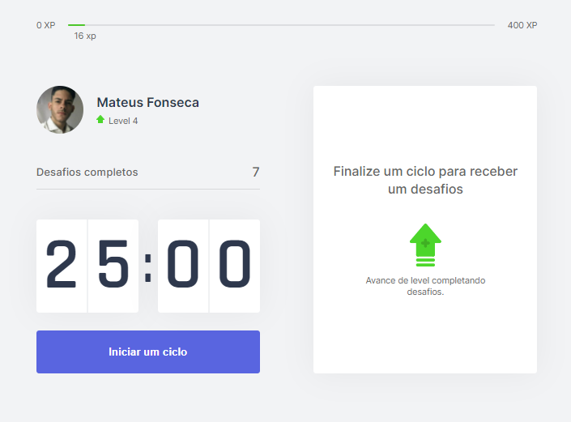

# Move.it

<p>
  

  

  

  <a href="https://github.com/mateusxfl/move-it/commits/master">
    
  </a>
</p>


## Tópicos 

[Sobre o Move.it](#sobre-o-move.it)

[Tecnologias](#tecnologias)

[Instalação e uso](#instalação-e-uso)

<br>

## Sobre o Move.it

O Move.it é um aplicativo que utiliza a técnica de [pomodoro](https://pt.wikipedia.org/wiki/T%C3%A9cnica_pomodoro), com o objetivo de melhorar sua produtividade e foco. Desenvolvido durante a Next Level Week #4 da [Rocketseat](https://rocketseat.com.br/).

<br>

<p align="center">
  <a href="https://www.figma.com/file/MrVj6IECrk0m4v44whwieH/Move.it-2.0-(Copy)?node-id=160%3A2761">
    
  </a>
</p>

<br>

<p align="center">
  
</p>

## Tecnologias

Tecnologias e ferramentas utilizadas no desenvolvimento do projeto:

- [React](https://reactjs.org/)
- [Next.js](https://nextjs.org/)
- [TypeScript](https://www.typescriptlang.org/)

## Instalação e uso

```bash
# Abra o terminal e copie este repositório com o comando.
$ git clone https://github.com/mateusxfl/move-it.git

# Entre na pasta com o comando .
$ cd move-it

# Instale as dependências.
$ npm install

# Rode a aplicação.
$ npx next dev
```

<br>

---

<br>

Feito com :purple_heart: by [Mateus Fonseca](https://mateusxfl/move-it)

[](https://www.linkedin.com/in/mateusxfl/) 
[](mailto:mateus.xfl@gmail.com)